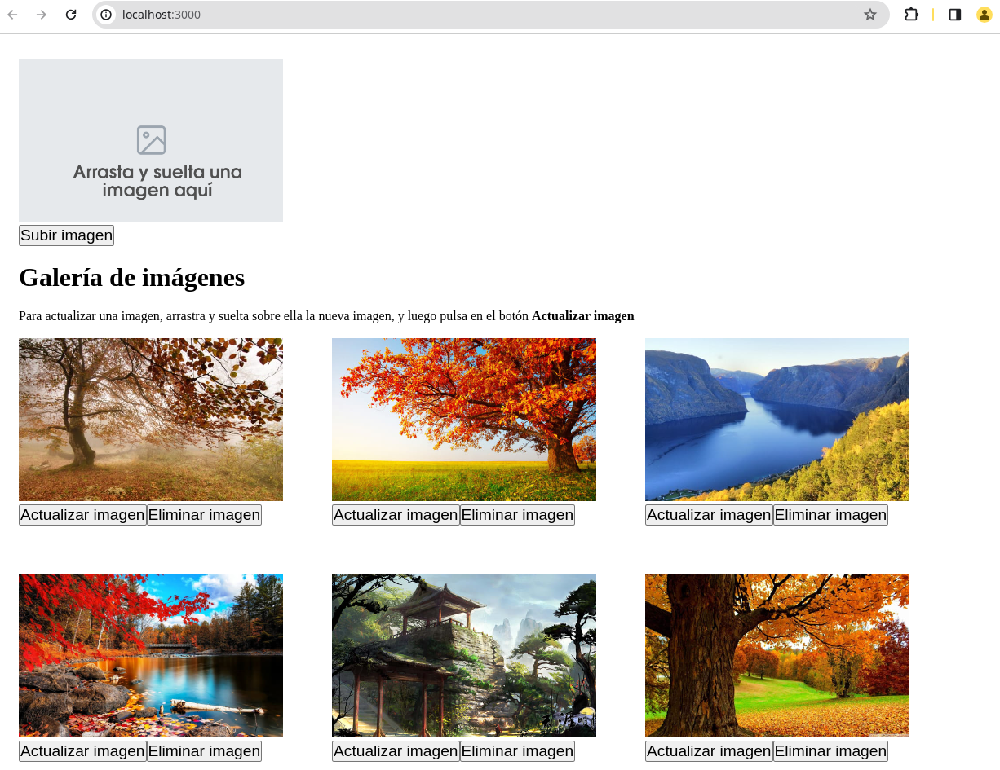

# GALERÍA DE IMÁGENES

Esta aplicación realizada con NextJS 13+, muestra una galería de imágenes alojadas en Cloudinary.

Además, usando la API proporcionada por Cloudinary, realiza las siguientes operaciones CRUD:

- **Create**: Sube una imagen 
- **Read**: Muestra las imágenes subidas
- **Upload**: Actualiza una imagen previamente subida
- **Delete**: Elimina una imagen previamente subida

## Funcionalidades añadidas:

- Todas las imágenes se suben a una carpeta llamada `galeria`, que se crea si no existe.
- Todas las imágenes, antes de ser subidas, son escaladas y recortadas para tener el mismo tamaño. En este caso 600x370 pixeles.
- Para mejor experiencia del usuario, el usuario puede **arrastrar y soltar** (drag & drop) la imagen a subir o actualizar al espacio destinado a ello.

## Probar por ti mismo

Si deseas ejecutar este aplicación para gestionar tu espacio en Cloudinary, deberás seguir estos pasos:

1. Crea un cuenta en Cloudinary.


2. Descarga el código fuente.

```sh
git clone https://github.com/jamj2000/nxcloudinary-crud.git
cd  nxcloudinary-crud
```

3. Edita el archivo `.env` con los datos de tu cuenta cloudinary.

```sh
mv  .env.example  .env
```
Y rellena las variables de entorno.

4. Ejecuta la aplicación.

```sh
npm install
npm run dev
```

5. Visita la URL `http://localhost:3000`

